# 腾讯2020秋季笔试题

## 第一轮

### 第一题：

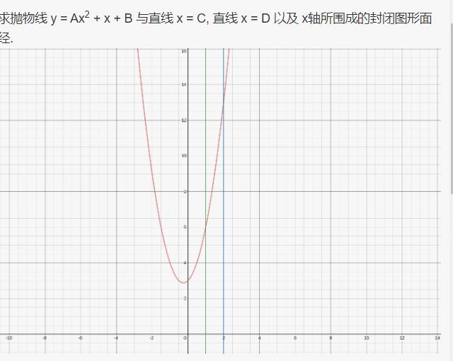

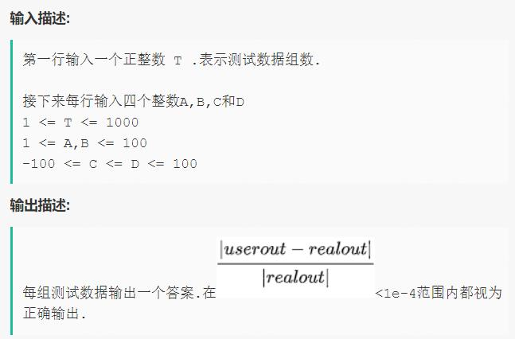

[code](T1-1.py)

***

### 第二题：

[code](T1-2.py)

***

### 第三题：

[code](T1-3.py)

***

### 第四题：

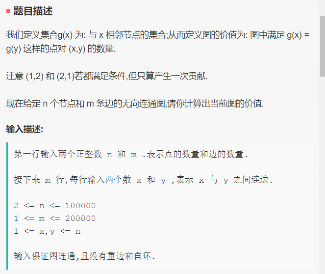

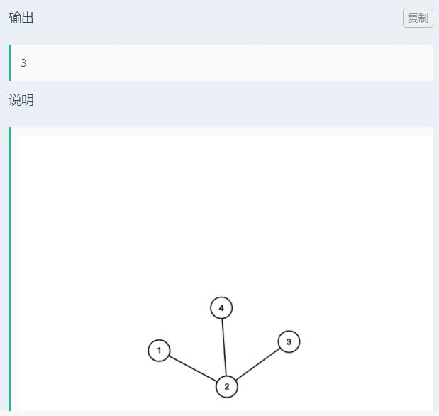

[code](T1-4.py)

***

### 第五题：

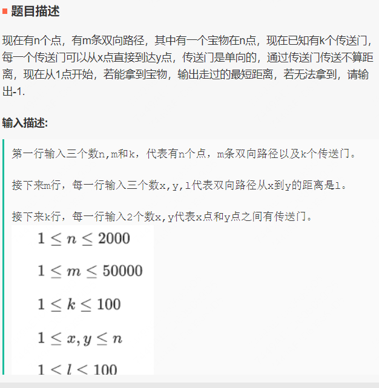

[code](T1-5.py)

## 第二轮

### 第一题：

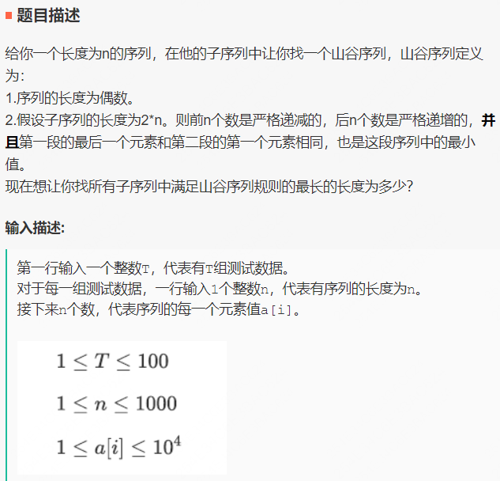

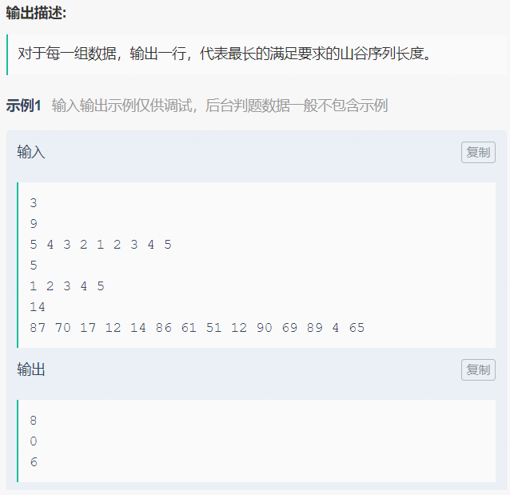

[code](T2-1.py)

****

### 第二题：

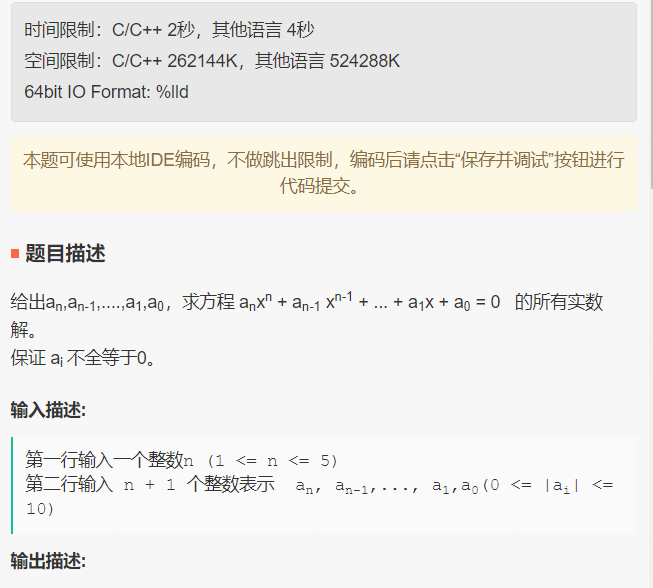

[code](T2-2.py)

***

### 第三题：

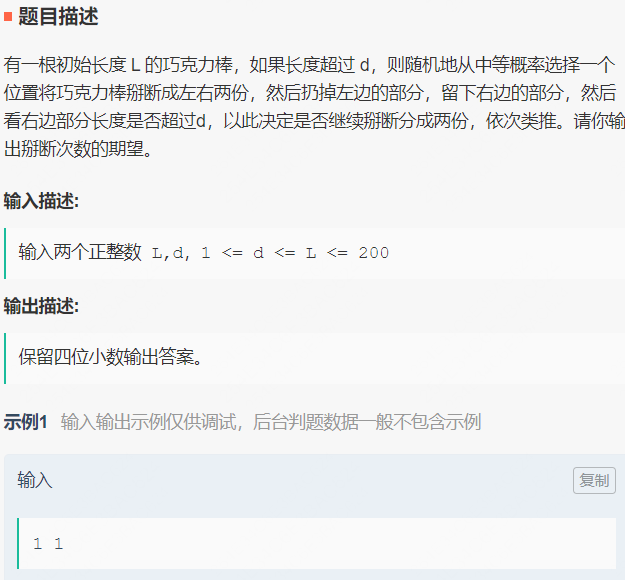

[code](T2-3.py)

**解析**：

**令**

$f(x)$：表示长度为$x$的巧克力棒到长度小于$d$的次数；

$\phi(i,x)=\frac{1}{x}$：表示长度为$x$的巧克力棒，在$i$点扳断的概率；

**则**：

$$f(x)=\left\{\begin{aligned} 0\qquad x\leq d \\ 1+\int_0^df(t)\phi(t)dt + \int_d^xf(t)\phi(t)dt \quad x > d \end{aligned}\right.$$

$$=\left\{\begin{aligned} 0\quad x\leq d \\ 1 + \int_d^xf(t)\phi(t)dt \quad x > d \end{aligned}\right.$$

$$=\left\{\begin{aligned} 0\quad x\leq d \\ 1 + (\int_d^xf(t)dt)/x \quad x > d \end{aligned}\right.$$

**解得**：

$$f(x)=\left\{\begin{aligned} 0\qquad x\leq d \\ 1+\ln{\frac{x}{d}} \quad x>d\end{aligned}\right.$$

***

### 第四题：

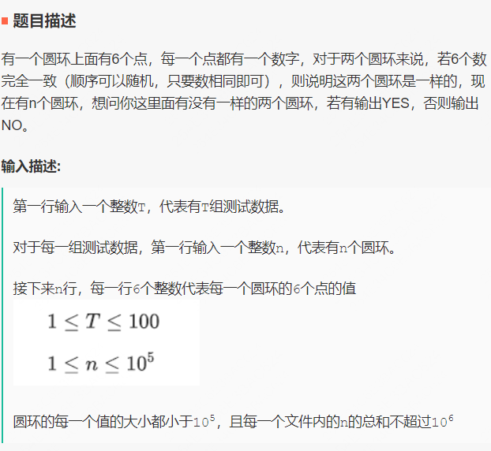

[code](T2-4.py)

***

### 第五题：

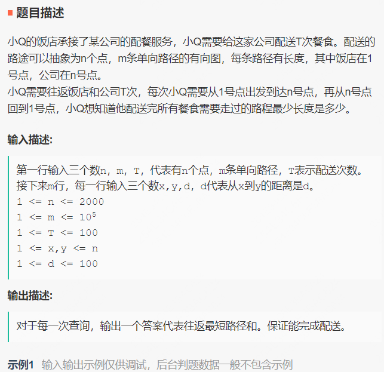

[code](T2-5.py)

